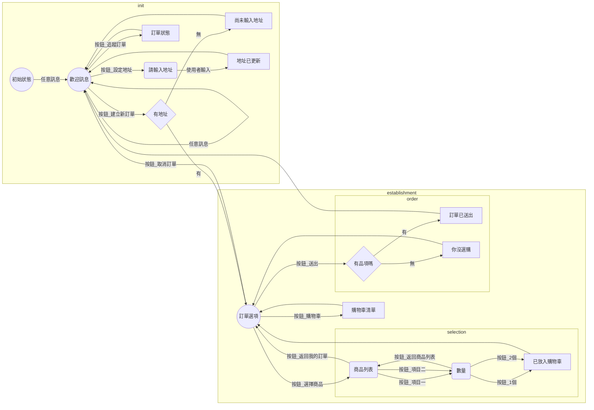

#	IoTtalk Project: LogisTalk (github)

This project is also contributed by all of Group 1 members.


## Introduction
### Features
- Real-time Logistic System with IotTalk platform and LineBot
- Detailed management of deilver trucks, order status, and time estimation

### Demo video
[Link](https://youtu.be/7yAnvEdo6qs)
    
## Component
- LineBot Server
    - Order establishment for customers   
    - Shipment/Arrive notifications
    - Track order status
- WebServer 
    - Customers  
        - Track order status with detailed delivery information
    - Manager
        - Trace couriers location
        - Track order status
- App for couriers
    - Task selection/acknowledgement
- IoTtalk
    - Data transmission
- Database
## Workflow
- Order establishment
    
- Start shipping
    
- Status tracking during shipment
    
- Order arrival
    


## How to run

- LineBot
    - setup `Profile.py`
    - Requirements：python3
    ```bash=
    #Setup DB
    python3 db.py
    
    #Launch Server
    python3 LineBot.py
    ```
- WebServer
    - Requirements：node.js、npm、express
    ```bash=
    # Create express project
    express
    
    # Install dependencies in package.json
    npm install
    
    # Launch Server
    npm start
    ```


### DB Structure
- Users

| field name |      data type      | description |
| ---------- | ------------------- | ----------- |
|   userID   | auto increment(int) | primary key |
|   lineID   |     varchar(255)    | 使用者line ID (unique) |

- Orders

| field name  |      data type      |              description              |
| ----------- | ------------------- | ------------------------------------- |
|   orderID   | auto increment(int) |              primary key              |
|   orderUID  |     varchar(255)    |                訂單編號 (unique)        |
|   userID    |         int         |       foreign key(Users.userID)       |
|   driverID  |         int         |     foreign key(Drivers.driverID)     |
|   address   |     varchar(255)    |                運送地址                 |
| addressLat  |        double       |                地址緯度                 |
| addressLong |        double       |                地址經度                 |
|establishTime|       datetime      |               訂單建立時間              |
| departTime  |       datetime      |             貨物開始運送時間             |
| arriveTime  |       datetime      |               貨物到達時間              |
|   status    |         int         | 0 = 還未配送 , 1 = 配送中 , -1 = 配送完畢 |


- Drivers

| field name |      data type      | description |
| ---------- | ------------------- | ----------- |
|  driverID  | auto increment(int) | primary key |
| driverName |     varchar(255)    |   司機姓名    |
|driverImage |     varchar(255)    |   司機圖片    |
|  account   |     varchar(255)    |   司機帳號 (unique)  　|
|  password  |     varchar(255)    |   司機密碼 　 |
|driverToken |     varchar(255)    |  司機token (null)   |


- Items

| field name |      data type      | description |
| ---------- | ------------------- | ----------- |
|   itemID   | auto increment(int) | primary key |
|  itemName  |     varchar(255)    |   商品名稱 (unique)    |
|  itemPrice |         int         |   商品價格    |
|  itemImage |     varchar(255)    |   圖片網址    |


- OrdersItemsXRef

|  field name   |      data type      |              description              |
| ------------- | ------------------- | ------------------------------------- |
| order_item_ID | auto increment(int) |              primary key              |
|    orderID    |         int         |      foreign key(Orders.orderID)      |
|    itemID     |         int         |       foreign key(Items.itemID)       |
|   itemNumber  |         int         |                買的數量                 |

### Protocol 訊息格式

- 使用者訂購：
    - request from LineBot:
        ```json
        {
            "type": "order_request",
            "content": {
            "orderId": orderID,
            "orderItem": orderItem,
            "address": address
            }
        }
        ```
    - ~~response from web server(需要性待討論)~~:
        ```json
        {
            "type": "order_response",
            "content": {
                "orderId": orderID,
                "orderItem": orderItem,
                "address": address,
                "result": true,
                "description": "None"
            }
        }
        ```
- 訂單狀態改變：
    - notification of updating order state from web server:
        ```json
        {
            "type": "state_update",
            "content": {
                "orderId": orderID,
                "status": int
            }
        }
        ```
        
- 司機push位置上iottalk:
    ```json
        {
            "driverId": driverID,
            "lat": 23.5,
            "long": 120
        }
    ```


### LineBot 對話流程：

- State_Machine:




### IotTalk API

- 登入 ( post )
    - http://140.113.123.90:9527/appLogin
        - account   ex: aaa
        - password  ex: bbb
    - 回傳值:
        - 成功:
        ```json
            {
                message: "Login Success",
                token: token,
                driverID: driverID
            }
        ```
        - 失敗:
        ```json
            {
                message: "Login Failure"
            }
        ```
- 取得未配送的訂單 ( get )
    - http://140.113.123.90:9527/appGetOrders 
        - token
    - 回傳值:
    ```json
        {
            "message": "valid token",
            "orders": [
                {
                    "orderID": 1,
                    "address": "tsetAddress",
                    "itemList": [
                        {
                            "itemName": "姆咪餅乾",
                            "itemNumber": "2",
                            "itemImage": "https://i.imgur.com/2KPrcAn.jpg"
                        },
                        {
                            "itemName": "姆咪飲料",
                            "itemNumber": "3",
                            "itemImage": "https://i.imgur.com/lSdMxPC.jpg"
                        }
                    ],
                    "orderPrice": 950
                },
                {
                    "orderID": 3,
                    "address": "tsetAddress",
                    "itemList": [
                        {
                            "itemName": "姆咪飲料",
                            "itemNumber": "2",
                            "itemImage": "https://i.imgur.com/lSdMxPC.jpg"
                        },
                        {
                            "itemName": "姆咪餅乾",
                            "itemNumber": "1",
                            "itemImage": "https://i.imgur.com/2KPrcAn.jpg"
                        }
                    ],
                    "orderPrice": 600
                }
            ]
        }
    ```
- 選擇訂單配送 ( post )
    - http://140.113.123.90:9527/appSelectOrders
        - token
        - driverID
        - orderID ( array )
    - 回傳值:
        - 成功:
        ```json
            {
                message: "Success"
            }
        ```
        - 失敗:
        ```json
            {
                message: "invalid token" or "invalid format" or "Not Login yet"
            }
        ```

- 查詢該司機尚未完成之訂單 ( get )
    - http://140.113.123.90:9527/appGetDriverOrders
        - token
        - driverID
    - 回傳值 : 和**取得未配送的訂單**相同
- 司機完成訂單 ( post )
    - web server 要檢查 app 傳來的訂單是不是這個司機負責的嗎
    - http://140.113.123.90:9527/appCompleteOrders
        - token
        - driverID
        - orderID ( array )
    - 回傳值 : 跟**選擇訂單配送**相同

